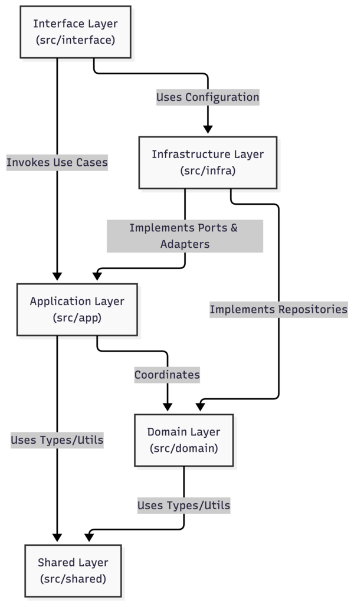
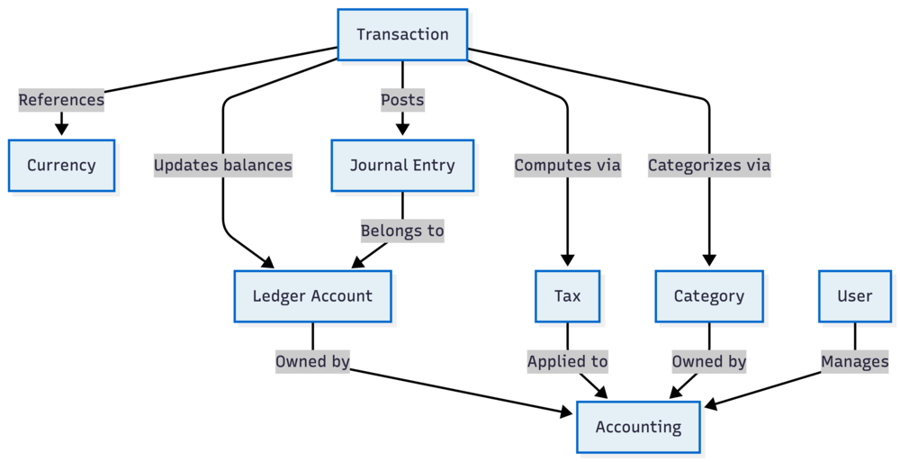

# 5. Building Block View

The building block view shows the static decomposition of the system into building blocks (modules, components, subsystems) as well as their dependencies. It explains the structure of the `PurpleLedger-core` application by zooming into its architectural layers and bounded contexts.

## 5.1 Level 1 (Whitebox: Overall System)

At the highest level, PurpleLedger Core strictly adheres to a Domain-Driven Design (DDD) and Clean Architecture pattern. The system is divided into functional layers where outer layers depend on inner layers, with the `Domain` layer at the absolute center, isolated from all external concerns.

_Figure 1: View the mermaid sourcecode here:&#x20;_[_05.1-level-1-system.mermaid_](./assets/05.1-level-1-system.mermaid)

### Building Blocks - Level 1

| Name                                   | Responsibility                                                                                                                                                                                                                                                            |
| -------------------------------------- | ------------------------------------------------------------------------------------------------------------------------------------------------------------------------------------------------------------------------------------------------------------------------- |
| **Interface Layer (`src/interface`)**  | The entry points to the application. It contains the HTTP REST controllers (generated via tsoa) and the Model Context Protocol (MCP) tool handlers for autonomous AI agents. It translates external requests into calls to the Application Layer.                         |
| **Application Layer (`src/app`)**      | Contains feature-grouped application rules and use cases. Each feature owns its DTOs, mappers, handlers, and use-case wiring while shared application contracts live under `src/app/shared`.                                                                              |
| **Domain Layer (`src/domain`)**        | The heart of the software. Contains pure enterprise-wide business rules, entities, domain services, and repository ports for accounting, bookkeeping, ledger, journal-entry, currency, subledger, and user contexts. It has zero dependencies on databases or frameworks. |
| **Infrastructure Layer (`src/infra`)** | Contains technical capabilities that support the layers above. This includes the database adapters (Drizzle ORM for PostgreSQL), external API integrations (Paystack, FIRS, Mono, ZeptoMail), caching (Redis), and observability configuration.                           |
| **Shared Layer (`src/shared`)**        | Cross-cutting concerns, ubiquitous utility functions (e.g., string and date utilities), value objects, shared errors, and shared domain types used across multiple boundaries.                                                                                            |

---

## 5.2 Level 2 (Whitebox: Domain Layer)

Zooming into the `Domain Layer` (the center of our architecture), the system is decomposed into bounded modules that enforce accounting entity ownership, ledger structure, journal posting rules, currency constraints, subledger detail, and user identity.

_Figure 2: View the mermaid sourcecode here:&#x20;_[_05.2-level-2-domain.mermaid_](./assets/05.2-level-2-domain.mermaid)

### Building Blocks - Level 2 (Domain Modules)

| Name              | Responsibility                                                                                                                                                                                                                          |
| ----------------- | --------------------------------------------------------------------------------------------------------------------------------------------------------------------------------------------------------------------------------------- |
| **Accounting**    | Represents the accounting entity whose books are being managed (Individual, Sole Trader, or Organization), plus reporting contexts, fiscal years, jurisdictions, and standards. All financial data is partitioned by accounting entity. |
| **Bookkeeping**   | Coordinates double-entry business operations, balance adjustments, opening balances, transfer recording, and account-transaction query models.                                                                                          |
| **Journal Entry** | Represents immutable journal headers and lines. Journal lines hold debit/credit movement while journal entries emit domain events for downstream processing.                                                                            |
| **Ledger**        | Defines the chart of accounts, account classes, account factories, account-code rules, balances, and ledger-account domain events.                                                                                                      |
| **Subledger**     | Holds detailed subsidiary records, such as currency lot tracking, that support GL balances without polluting the general ledger account model.                                                                                          |
| **Currency**      | Manages system-supported currencies, exchange-rate objects, and cross-currency calculations for deterministic functional-currency reporting.                                                                                            |
| **User**          | Represents the human operator or AI agent identity. A User manages access to one or many Accounting entities but is decoupled from the financial records themselves.                                                                    |
