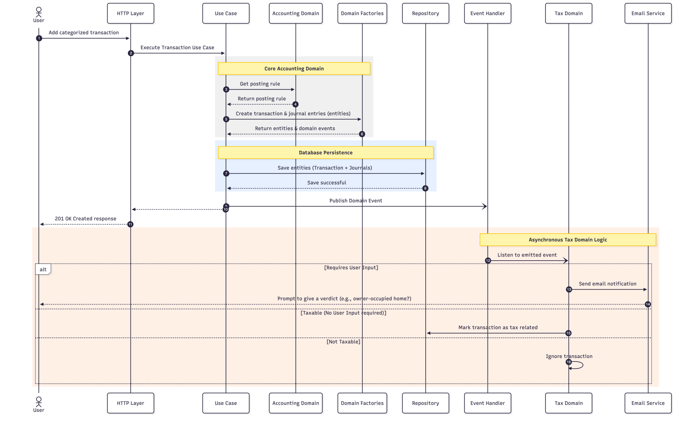

# 6. Runtime View

The runtime view describes the concrete behavior and interactions of the system’s building blocks in the form of scenarios. It explains how the components detailed in the Building Block View interact at runtime to fulfill the most critical use cases of PurpleLedger Core.

## 6.1 Transfer Journal Entry Flow (End-to-End)

This scenario illustrates the complete lifecycle of a transfer journal entry being recorded by a user. The HTTP layer establishes request context, the application use case validates the payload and resolves exchange-rate information, the Bookkeeping domain records balanced journal entries, and the application layer persists and publishes resulting domain events.

### 6.1.1 Overview Diagram

_Figure 1: View the mermaid sourcecode here:&#x20;_[_06.1-core-accounting-flow.mermaid_](./assets/06.1-core-accounting-flow.mermaid)

### 6.1.2 Step-by-Step Description

| Step      | Component                         | Action                                                                                                                                                                       |
| --------- | --------------------------------- | ---------------------------------------------------------------------------------------------------------------------------------------------------------------------------- |
| Step      | Component                         | Action                                                                                                                                                                       |
| --------  | --------------------------------- | ---------------------------------------------------------------------------------------------------------------------------------------------------------------------------  |
| **1-2**   | **HTTP Layer & Request Context**  | The User submits a transfer journal-entry request. Request context is initialized with the authenticated user, correlation ID, and optional `x-accounting-entity-id` header. |
| **3-5**   | **Bookkeeping Use Case**          | The `Use Case` validates the payload, reads the accounting entity from request context, resolves the entity's functional currency, and loads required exchange rates.        |
| **6-7**   | **Bookkeeping Domain Service**    | The use case delegates to `bookkeepingService.recordTransaction`, which creates balanced journal entries and returns domain events.                                          |
| **8-9**   | **Journal Entry Repository**      | The use case persists the journal entries through the journal-entry repository.                                                                                              |
| **10-12** | **Event Bus & HTTP Response**     | The use case enriches emitted events with trace context, publishes them through the application event bus, and the HTTP layer returns a success response.                    |
